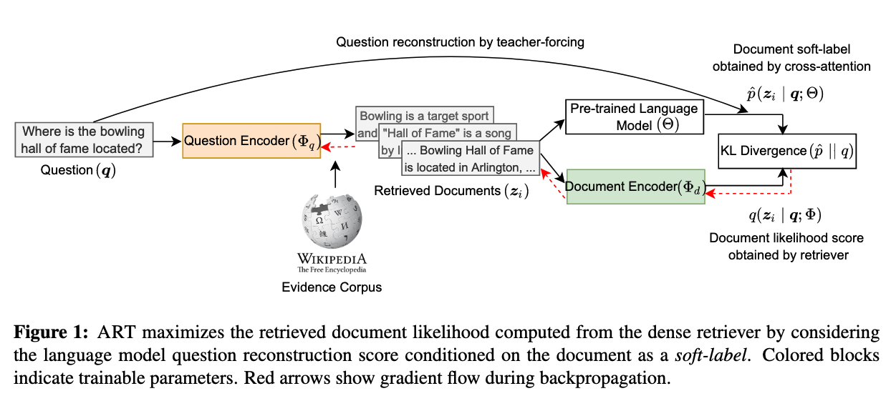

<a id="contents"></a>
# Contents
<!-- MarkdownTOC -->

- [Setup](#setup)
- [Downloading Data and Checkpoints](#downloading-data-and-checkpoints)
- [Training](#training)
- [Pre-trained Checkpoints](#pre-trained-checkpoints)
- [Issues](#issues)
- [Citation](#citation)

<!-- /MarkdownTOC -->

[ART](https://arxiv.org/abs/2206.10658) is a dense retriever training algorithm developed for the task of passage / document retrieval.


<p align="center">
  
</p>


<a id="setup"></a>
# Setup

To use this repo, a standard installation of [PyTorch](https://pytorch.org/) along with [Apex](https://github.com/NVIDIA/apex) is needed.
We provide dependencies (and their versions used in our work) in the requirements.txt file.

We recommend using one of [NGC's more recent containers](https://catalog.ngc.nvidia.com/orgs/nvidia/containers/pytorch/tags) that come with PyTorch and Apex pre-installed. 
The docker image we used can be pulled with the command `docker pull nvcr.io/nvidia/pytorch:22.01-py3`.
To use this docker image, an installation of the [Nvidia container toolkit](https://docs.nvidia.com/datacenter/cloud-native/container-toolkit/install-guide.html#install-guide) is also required.

To run the above image in an interactive mode, please use this command
<pre>
sudo docker run --ipc=host --gpus all -it --rm -v /mnt/disks:/mnt/disks nvcr.io/nvidia/pytorch:20.10-py3 bash
</pre>
, where `/mnt/disks` is the directory to be mounted.

Over the docker container, please install the libraries `transformers`, `sentencepiece`, `spacy`, and `jsonlines` using pip install.


<a id="downloading-data-and-checkpoints"></a>
## Downloading Data and Checkpoints
We have provided datasets and initial retriever checkpoints to train models for dense retrieval. 

We have also provided a script [`download_data.sh`](./examples/helper-scripts/download_data.sh) that will download all the required datasets. 
Run this script by providing a directory path in the first argument.
```bash
bash examples/helper-scripts/download_data.sh DIRNAME
```

These files can also be downloaded separately by using the `wget` command-line utility and the links provided below.

##### Required data files for training
- [Wikipedia evidence passages](https://www.dropbox.com/s/bezryc9win2bha1/psgs_w100.tar.gz)
- [BERT pre-tokenized evidence passages and their titles](https://www.dropbox.com/s/yxsne7qzz848pk4/indexed-evidence-bert-tokenized.tar.gz)
- [T0 pre-tokenized evidence passages and their titles](https://www.dropbox.com/s/4tvvll8qeso7fal/indexed-evidence-t0-tokenized.tar.gz)
- [Training and evaluation datasets](https://www.dropbox.com/s/yj7hukwyl04hvs3/qas.tar.gz)
- [BERT-large vocabulary file](https://www.dropbox.com/s/ttblv1uggd4cijt/bert-large-uncased-vocab.txt)

##### Required checkpoints and pre-computed evidence embeddings
- [Masked Salient Span (MSS) pre-trained retriever](https://www.dropbox.com/s/069xj395ftxv4hz/mss-emdr2-retriever-base-steps82k.tar.gz)
- [Precomputed evidence embedding using MSS retriever](https://www.dropbox.com/s/y7rg8u41yavje0y/psgs_w100_emdr2-retriever-base-steps82k_full-wikipedia_base.pkl): This is a big file with 32 GB size.


<a id="training"></a>
# Training

We have provided an example script for training models for dense retriever in [`examples`](./examples) directory.

Please ensure to change the data and checkpoint paths in these scripts.

To replicate the results on the Natural Questions-Open (NQ-Open) dataset, run the script as
```
bash examples/zero_shot_retriever/art_nq.sh
```

For training, we used a single node of 16 A100 GPUs with 40GB GPU memory. The training can also be performed on 8 A100 GPUs (with 40GB or 80GB RAM) or 8 A6000 GPUs (with 48GB RAM).

We used the same hyperparameters as mentioned in the above script for other datasets as well, except for WebQuestions where we used a batch size of 16 and 20 epochs for training.

<a id="pre-trained-checkpoints"></a>
# Pre-trained Checkpoints

We are working to add pre-trained checkpoints.


<a id="issues"></a>
# Issues

For any errors or bugs in the codebase, please either open a new issue or send an email to Devendra Singh Sachan (sachan.devendra@gmail.com) . 

<a id="citation"></a>
# Citation

If you find these codes useful, please consider citing our paper as:
```
@inproceedings{sachan2021questions,
    title={Questions Are All You Need to Train a Dense Passage Retriever},
    author={Devendra Singh Sachan and Mike Lewis and Dani Yogatama and Luke Zettlemoyer and Joelle Pineau and Manzil Zaheer},
    journal={arXiv preprint arXiv:2206.10658},
    year={2022},
    url={https://arxiv.org/abs/2206.10658}
}
```
