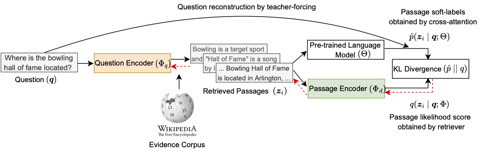

<a id="contents"></a>
# Contents
<!-- MarkdownTOC -->

- [Setup](#setup)
- [Downloading Data and Checkpoints](#downloading-data-and-checkpoints)
- [Training](#training)
- [Pre-trained Checkpoints](#pre-trained-checkpoints)
- [Issues](#issues)
- [Citation](#citation)

<!-- /MarkdownTOC -->

[ART](https://arxiv.org/abs/2206.10658) is an *auto-encoding based retriever training* algorithm developed for the task of passage retrieval.


<p align="center">
  
</p>

ART maximizes the retrieved passage likelihood computed from the dense retriever by considering the language model question reconstruction score conditioned on the passage as a *soft-label*.
Colored blocks indicate trainable parameters. Red arrows show gradient flow during backpropagation.

<a id="setup"></a>
# Setup

* To use this repo, a standard installation of [PyTorch](https://pytorch.org/) along with [Apex](https://github.com/NVIDIA/apex) is needed.
We provide dependencies (and their versions used in our work) in the requirements.txt file.

* We recommend using one of [NGC's more recent containers](https://catalog.ngc.nvidia.com/orgs/nvidia/containers/pytorch/tags) that come with PyTorch and Apex pre-installed. 
The docker image we used can be pulled with the command `docker pull nvcr.io/nvidia/pytorch:22.01-py3`.
To use this docker image, an installation of the [Nvidia container toolkit](https://docs.nvidia.com/datacenter/cloud-native/container-toolkit/install-guide.html#install-guide) is also required.

* To run the above image in an interactive mode, please use this command
<pre>
sudo docker run --ipc=host --gpus all -it --rm -v /mnt/disks:/mnt/disks nvcr.io/nvidia/pytorch:22.01-py3 bash
</pre>
, where `/mnt/disks` is the directory to be mounted.

* Over the docker container, please install the libraries `transformers`, `sentencepiece`, `spacy`, and `jsonlines` using pip install.


<a id="downloading-data-and-checkpoints"></a>
## Downloading Data and Checkpoints
We have provided datasets and initial retriever checkpoints to train models for dense retrieval. 

We have also provided a script [`download_data.sh`](./examples/helper-scripts/download_data.sh) that will download all the required datasets. 
Run this script by providing a directory path in the first argument.
```bash
bash examples/helper-scripts/download_data.sh DIRNAME
```

These files can also be downloaded separately by using the `wget` command-line utility and the links provided below.

#### Required data files for training
- [Wikipedia evidence passages](https://www.dropbox.com/s/bezryc9win2bha1/psgs_w100.tar.gz)
- [BERT pre-tokenized evidence passages and their titles](https://www.dropbox.com/s/yxsne7qzz848pk4/indexed-evidence-bert-tokenized.tar.gz)
- [T0 pre-tokenized evidence passages and their titles](https://www.dropbox.com/s/4tvvll8qeso7fal/indexed-evidence-t0-tokenized.tar.gz): This will work for both T0 and T5 models.
- [Training and evaluation datasets](https://www.dropbox.com/s/jufz5g88w5v07qc/qas.tar.gz): NQ-Open, Nq-Full, TriviaQA, SQuAD1, WebQ, EntityQuestions, MS MARCO.
- [BERT-large vocabulary file](https://www.dropbox.com/s/ttblv1uggd4cijt/bert-large-uncased-vocab.txt)

The BERT pre-tokenized evidence file(s) can also be obtained by the command:
```bash
python tools/create_evidence_indexed_dataset.py --input /mnt/disks/project/data/wikipedia-split/psgs_w100.tsv --tsv-keys text title --tokenizer-type BertWordPieceLowerCase --vocab-file /mnt/disks/project/bert-vocab/bert-large-uncased-vocab.txt --output-prefix wikipedia-evidence-bert --workers 25 
```

The T0/T5 pre-tokenized evidence file(s) can also be obtained by the command:
```bash
python tools/create_evidence_indexed_dataset_t0.py --input /mnt/disks/project/data/wikipedia-split/psgs_w100.tsv --tsv-keys text title  --output-prefix wikipedia-evidence-t0 --workers 25
```


#### Required checkpoints and pre-computed evidence embeddings
- [Masked Salient Span (MSS) pre-trained retriever](https://www.dropbox.com/s/069xj395ftxv4hz/mss-emdr2-retriever-base-steps82k.tar.gz)
- [Precomputed evidence embedding using MSS retriever](https://www.dropbox.com/s/y7rg8u41yavje0y/psgs_w100_emdr2-retriever-base-steps82k_full-wikipedia_base.pkl): This is a big file with 32 GB size.

The evidence embeddings for a retriever checkpoint can be computed and evaluated with the command
```bash
bash examples/indexer-scripts/create_evidence_embeddings_and_evaluate.sh RETRIEVER_CHECKPOINT_PATH
```
Please ensure to change the data path in this script. 

For example, to compute the Wikipedia evidence embeddings corresponding to the above MSS retreiver checkpoint and evaluate it on NQ-Open dev and test sets, it can be done with
```bash
bash examples/indexer-scripts/create_evidence_embeddings_and_evaluate.sh mss-retriever-base/iter_0082000
```


<a id="training"></a>
# Training

* We have provided an example script for training models for dense retriever in [`examples/zero-shot-retriever-training`](examples/zero-shot-retriever-training) directory.
  Please ensure to change the data and checkpoint paths in these scripts. If you have downloaded the data in the previous step using the download script, then just provide the DIRNAME path in line 3.

* To replicate the results on the Natural Questions-Open (NQ-Open) dataset, please run the script as
```bash
bash examples/zero-shot-retriever-training/art-nq-T0-3B.sh
```

* This script uses (unsupervised) [masked salient spans (MSS)](https://arxiv.org/abs/2106.05346) pre-trained retriever to initialize the retriever weights, and [T0-3B pre-trained language model](https://arxiv.org/abs/2110.08207) weights for the cross-attention scorer.

* This script trains the base configuration of dense retriever for 10 epochs, 64 batch size (per GPU batch size of 4), retrieves 32 documents at every step and optimizes using Adam optimizer. After every 500 steps, the code is setup to re-compute evidence document embeddings and evaluates on both the dev and test sets. 

* Retriever checkpoints are saved after every `--save-interval` steps. Recomputing evidence embeddings can be configured using the option of `--index-reload-interval` and evaluation interval can be configured using the option of `--eval-interval`.
It is recommended to set `--eval-interval` as a multiple of `--save-interval`. 
The option of `--shard-size` controls for how many topk documents for a question to select for the cross-attention step. A smaller value should lower the memory footprint in GPUs.

* For training, we used a single node of 16 A100 GPUs with 40GB GPU memory. 
The training can also be performed on 8 A100 GPUs (with 40GB or 80GB RAM) or 8 A6000 GPUs (with 48GB RAM).

* Using Ampere GPUs provides speed ups and memory savings as the T0 model can be used in `bf16` floating-point format with the argument `--t0-model-in-bf16`. 
However, when working with V100 GPUs, this argument should be removed as they don't support `bf16` data type and the training could be much slower.

* When using 8 GPUs, please set the per GPU batch size to 8 with the argument `--batch-size 8` as this will lead to a global batch size of 64.

* We used the same hyperparameters as mentioned in the above script for other datasets as well, except for WebQuestions where we used a batch size of 16 and 20 epochs for training.

* When training with T5-lm-adapted-xxl PLM (11B), we use a batch size of 32 and retrieve top-16 passages at every step. We provide a separate script for this training
```bash
bash examples/zero-shot-retriever-training/art-nq-t5-lm-adapted-11B.sh
```

* The details for training on MS MARCO dataset are included in the branch `msmarco`. The code is not very clean but the default scripts should work fine.

* Once training is completed, the retriever checkpoint can be saved from the model checkpoint (in ${CHECKPOINT_PATH}) as
```bash
RETRIEVER_CHECKPOINT_PATH=${CHECKPOINT_PATH}"-tmp"
python tools/save_art_retriever.py --load ${CHECKPOINT_PATH} --save ${RETRIEVER_CHECKPOINT_PATH} --submodel-name "retriever"
```

<a id="pre-trained-checkpoints"></a>
# Pre-trained Checkpoints

* We have provided pre-trained retriever checkpoints whose URL is indicated in the (url) tag.
The evidence embeddings for a retriever checkpoint can be computed and evaluated with the command
```bash
bash examples/indexer-scripts/create_evidence_embeddings_and_evaluate.sh RETRIEVER_CHECKPOINT_PATH/iter_000xxyy
```
Please ensure to change the data path in this script.


#### Top-20 / top-100 accuracy when trained using questions from each dataset.
* "Multi" setting denotes that a single retriever model has been trained using the questions from all the datasets. 


Retriever | Cross-Attention PLM         |  SQuAD-Open | TriviaQA | NQ-Open | WebQ |
 ---------|:----------------------------|:-----------:|:-------:|:------:|:------:|
ART       | T5-lm-adapt (11B)           | 74.2 / 84.3 [(url)](https://www.dropbox.com/s/v064xnatpvjzhni/squad1-mss-base-init-t5-xxl-lm-adapt.tar.gz)| 82.5 / 86.6 [(url)](https://www.dropbox.com/s/id3pzpqorz12e3b/trivia-mss-base-init-t5-xxl-lm-adapt.tar.gz) | 80.2 / 88.4 [(url)](https://www.dropbox.com/s/7ss4xbb3kku4iuv/nq-mss-base-init-t5-xxl-lm-adapt.tar.gz)| 74.4 / 82.7 [(url)](https://www.dropbox.com/s/unq1q2qospgnukb/webq-mss-base-init-t5-xxl-lm-adapt.tar.gz)| 
ART-Multi [(url)](https://www.dropbox.com/s/8mocfhcwq2dmwsa/multi-train-mss-base-init-t5-xxl-lm-adapt.tar.gz) | T5-lm-adapt (11B) | 72.8 / 83.2 | 82.2 / 86.6 | 81.5 / 88.5 | 74.8 / 83.7 | 
ART       | T0 (3B)                     | 75.3 / 85.0 [(url)](https://www.dropbox.com/s/946tl9wp9l2gpc0/squad1-mss-base-init-T0-3B.tar.gz)| 82.9 / 87.1 [(url)](https://www.dropbox.com/s/blt2pwggrx4gzky/trivia-mss-base-init-T0-3B.tar.gz)| 81.6 / 89.0 [(url)](https://www.dropbox.com/s/nc99vhoqndzj8ud/nq-mss-base-init-T0-3B.tar.gz)| 75.7 / 84.3 |
ART-Multi [(url)](https://www.dropbox.com/s/b2sxvj9fcsevde3/multi-train-mss-base-init-T0-3B.tar.gz) | T0 (3B)           | 74.7 / 84.5 | 82.9 / 87.0 | 82.0 / 88.9 | 76.6 / 85.0 |  


#### Top-20 / top-100 accuracy when trained using all the questions released in the Natural Questions dataset (NQ-Full) and / or MS MARCO.

Training Questions | Checkpoint | Cross-Attention PLM         |  SQuAD-Open | TriviaQA | NQ-Open | WebQ |
 ---------|:---:|:----------------------------|:-----------:|:-------:|:------:|:------:|
NQ-Full | [url](https://www.dropbox.com/s/hh0ro26im1g80co/nq-full-307k-mss-base-init-t5-xxl-lm-adapt.tar.gz) | T5-lm-adapt (11B) | 67.3 / 79.0 | 79.4 / 84.9 | 81.7 / 88.8 | 73.4 / 82.9 |  
NQ-Full | [url](https://www.dropbox.com/s/4s1xiipf7173nyp/nq-full-307k-mss-base-init-T0-3B.tar.gz) | T0 (3B) | 69.4 / 81.1 | 80.3 / 85.7 | 82.0 / 88.9 | 74.3 / 83.9 | 
MS MARCO | [url](https://www.dropbox.com/s/2huz1evykey5nno/msmarco-mss-base-init-bs512-topk4-epochs10.tar.gz) | T0 (3B) | 68.4 / 80.4 | 78.0 / 84.1 | 77.8 / 86.2 | 74.8 / 83.2 | 
MS MARCO + NQ-Full | [url](https://www.dropbox.com/s/wmoqcd4rwglyl96/msmarco-nq-all-mss-base-init-bs64-topk32.tar.gz) | T0 (3B) | 69.6 / 81.1 | 80.7 / 85.7 | 82.3 / 89.1 | 75.3 / 84.5 | 


#### Scaling up ART training to large configuration of retriever
* Please use the following checkpoints to reproduce results reported in Table 4 of the paper.

Evaluation Split| Config |  Cross-Attention PLM         |  NQ-Open | TriviaQA |
|:---------|:---|:-----------:|:-----------:|:-------:|
Dev | Base | T0 (3B) | 80.6 / 87.4 [(url)](https://www.dropbox.com/s/nc99vhoqndzj8ud/nq-mss-base-init-T0-3B.tar.gz) | 83.6 / 87.4 [(url)](https://www.dropbox.com/s/blt2pwggrx4gzky/trivia-mss-base-init-T0-3B.tar.gz) |
Dev | Large | T0 (3B) | 81.0 / 87.8 [(url)](https://www.dropbox.com/s/00upa5fx3kf1afo/nq-ict-init-T0-3B-large.tar.gz) | 83.7 / 87.5 [(url)](https://www.dropbox.com/s/7melarvj5u245ut/trivia-ict-init-T0-3B-large.tar.gz) |

Evaluation Split| Config |  Cross-Attention PLM         |  NQ-Open | TriviaQA |
|:---------|:---|:-----------:|:-----------:|:-------:|
Test | Base | T0 (3B) | 81.6 / 89.0 | 82.9 / 87.1 |
Test | Large |T0 (3B) | 82.1 / 88.8 | 83.6 / 87.6 |


# Helper Scripts

* Create Wikipedia memory-mapped index using BERT tokenizer
```python
python tools/create_evidence_indexed_dataset.py --input /mnt/disks/project/data/dpr/wikipedia_split/psgs_w100.tsv --tsv-keys text title --tokenizer-type BertWordPieceLowerCase --vocab-file /mnt/disks/project/bert-vocab/bert-large-uncased-vocab.txt --output-prefix wikipedia-evidence --workers 25
```


<a id="issues"></a>
# Issues

For any errors or bugs in the codebase, please either open a new issue or send an email to Devendra Singh Sachan (sachan.devendra@gmail.com) . 

<a id="citation"></a>
# Citation

If you find these codes useful, please consider citing our paper as:
```
@article{sachan2021questions,
    title={Questions Are All You Need to Train a Dense Passage Retriever},
    author={Devendra Singh Sachan and Mike Lewis and Dani Yogatama and Luke Zettlemoyer and Joelle Pineau and Manzil Zaheer},
    journal={Transactions of the Association for Computational Linguistics},
    year={2022},
    url={https://arxiv.org/abs/2206.10658}
}
```
